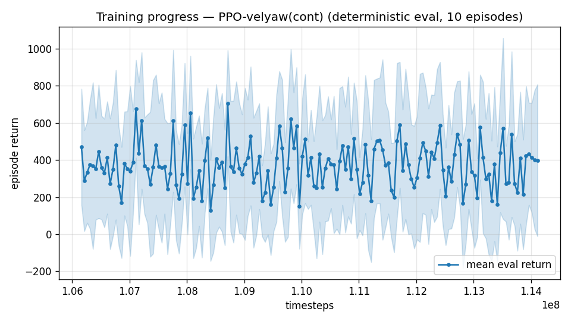

# Trial 63 — xw63: 25–34 precision from the RANGE-MATCHED lineage

## Why
Trial 62 ran the 25–34 precision ladder from the over-extended covering policy (xw60a,
trained to 40 m/s) and got 5.30 — worse than xw55a's 3.77 on the same range. Coverage and
precision trade off inside one network. This repeats the ladder from the range-matched
source (xw55a) to separate "the precision stack fails at 25+" from "the source policy was
stretched too far".

## Exact code changes
None — band flags (trial 45), oversampling (35), robust gate (33).

## Pre-registered (vs xw55a 3.77 on 25–34)
- SUCCESS: ≤2.5 → precision stack works at 25+ given a range-matched source; the fast-band
  path is per-range specialists, and the composite roster updates.
- NULL/FAILURE: ≥3.5 → precision above 25 m/s needs a mechanism, not stages. Combined with
  trial 61's outcome, that is the trigger to escalate the trim-feedforward decision.

## Result
*(auto-appended)*

## VERDICT: FAILURE — 5.06 [CI 4.28–6.45] vs 3.77, and the pair of failures is informative
| source lineage | trained range | 25–34 median |
|---|---|---|
| xw55a (as-is, no further training) | 21–34 | **3.77** |
| xw60a → xw62a (stretched to 40, then narrowed to 25–34) | 25–34 | 5.30 |
| xw55a → xw63a (narrowed to 25–34) | 25–34 | 5.06 |

**Narrowing the training range to the evaluated band made performance on that band WORSE**
(3.77 → 5.06), and stretching it wider also hurt (→5.30). The best 25–34 policy is the one
trained on 21–34 — a range that *includes slower targets as scaffold*.

This mirrors trial 15's low-band result (specialization alone bought nothing over the
generalist) and extends it: at high dynamic pressure, an all-hard target distribution
removes the easy-win gradient that keeps the policy near competent behaviour. There is an
optimal range width — wide enough to retain scaffold, narrow enough to avoid dilution —
and ~13 m/s of span (21–34) is better than 9 (25–34) or 13 shifted up (27–40).

**Practical rule for the remaining work: train fast bands on a span that reaches ~4–6 m/s
below the target band, and evaluate on the band.** The 25–34 champion stays xw55a (3.77).

---

## AUTO-CAPTURED RESULTS (2026-08-05 03:58)

**config**: `{"max_speed": 34.0, "speed_min": 25.0, "wind_max": 15.0, "use_integral": true, "use_yaw_integral": true, "use_wind_est": true, "yaw_width": 0.35, "yaw_weight": 1.0, "yaw_bias": 0.3, "heading_frame": false, "xwing_aero": true, "tough_init": 0.0, "wind_curriculum": false, "yaw_gate": true, "yaw_gate_floor": 0.2, "vel_precision": 0.7, "trim_init": 0.2, "priv_critic": false, "att_cmd": true, "katt": 1.5, "yaw_att_gate": true, "cov_width": 5.0, "kp_rate": "25,25,15", "ki_rate": "6,6,3", "aero_dr": true, "integral_tau": 3.0, "ent_coef": 0.003, "gamma": 0.99, "episode_len": 8.0, "wind_oversample": 0.5}`

**eval curve**: n=160, first 421, best 693 @ 115,125,048, last 378 (final steps 122,124,768)

**late trend**: DECLINING (last-10% mean 353 vs prior-10% 373)


### Physical eval
```
=== PHYSICAL EVAL (level start, full wind, 8s episodes) ===

band           n    mean  median   %<1     p90     yaw
--------------------------------------------------------
vhigh(25-35) 100    7.70    3.97    4%   18.22   23.6°
--------------------------------------------------------
ALL          100    7.70    3.97    4%   18.22   23.6°   crash 0.0%
wind bins: [0-5) n=23 med 3.63 <1: 9%  [5-10) n=42 med 3.94 <1: 5%  [10-15) n=35 med 5.05 <1: 0%
```


### Dive-recovery test
```
=== DIVE-RECOVERY TEST (60 episodes, all starting in failure states) ===
  recovered (final-2s vel err < 8 m/s):  10/60 = 17%
  partial   (8-15 m/s):                  4/60 = 7%
  median final err: 33.8 m/s   mean: 35.3 m/s
```


### Behavior traces
```
--- trace seed 1005: target [27.2 11.9  0.6] (|v|=29.7), wind [ -3.6 -11.6  -3.1] ---
  t= 0.0 |v|=  0.1 vz=   0.0 tilt=   0 verr= 29.7 yawerr=+103.5 fins=( +7.1, -3.1) thr=+1.00
  t= 2.0 |v|= 18.3 vz=   2.1 tilt=  72 verr= 11.6 yawerr= +35.3 fins=(+18.5,+18.9) thr=-0.52
  t= 4.0 |v|= 24.0 vz=   3.4 tilt=  68 verr=  6.8 yawerr=  +1.9 fins=(+18.5, -1.0) thr=-1.00
  t= 6.0 |v|= 27.9 vz=   9.3 tilt=  44 verr=  9.9 yawerr= +11.2 fins=(+18.5, +2.0) thr=-1.00
--- trace seed 1012: target [ 11.  -29.3   2.5] (|v|=31.4), wind [-0.3  4.1 -6.1] ---
  t= 0.0 |v|=  0.0 vz=   0.0 tilt=   0 verr= 31.4 yawerr= +46.7 fins=(+10.1, -8.9) thr=+1.00
  t= 2.0 |v|= 24.5 vz=   3.0 tilt=  62 verr=  7.4 yawerr=  +8.0 fins=(-14.2,-18.2) thr=-0.54
  t= 4.0 |v|= 28.3 vz=   2.1 tilt=  63 verr=  3.5 yawerr=  +2.8 fins=( -7.9,-18.2) thr=+0.00
  t= 6.0 |v|= 28.8 vz=   1.7 tilt=  61 verr=  3.1 yawerr=  +5.2 fins=( -6.4,-18.2) thr=-0.74
--- trace seed 1020: target [-20.1  22.6   1.9] (|v|=30.3), wind [-0.3 -1.2 -0.6] ---
  t= 0.0 |v|=  0.0 vz=   0.0 tilt=   0 verr= 30.3 yawerr= -65.7 fins=(+10.6,+10.9) thr=+1.00
  t= 2.0 |v|= 25.2 vz=   4.5 tilt=  46 verr=  6.6 yawerr= +14.5 fins=(+18.2,-20.0) thr=-1.00
  t= 4.0 |v|= 26.5 vz=   2.3 tilt=  63 verr=  4.3 yawerr= +12.7 fins=(-13.8,-20.0) thr=-1.00
  t= 6.0 |v|= 27.2 vz=   4.1 tilt=  63 verr=  4.1 yawerr=  +2.6 fins=(-14.0,-20.0) thr=-1.00
```

---

## AUTO-CAPTURED RESULTS (2026-08-05 04:01)

**config**: `{"max_speed": 34.0, "speed_min": 21.0, "wind_max": 15.0, "use_integral": true, "use_yaw_integral": true, "use_wind_est": true, "yaw_width": 0.35, "yaw_weight": 1.0, "yaw_bias": 0.3, "heading_frame": false, "xwing_aero": true, "tough_init": 0.0, "wind_curriculum": false, "yaw_gate": true, "yaw_gate_floor": 0.2, "vel_precision": 0.7, "trim_init": 0.2, "priv_critic": false, "att_cmd": true, "katt": 1.5, "yaw_att_gate": true, "cov_width": 5.0, "kp_rate": "25,25,15", "ki_rate": "6,6,3", "aero_dr": true, "integral_tau": 3.0, "ent_coef": 0.003, "gamma": 0.99, "episode_len": 8.0, "wind_oversample": 0.5}`

**eval curve**: n=160, first 470, best 706 @ 108,713,208, last 398 (final steps 114,112,992)

**late trend**: still rising (last-10% mean 364 vs prior-10% 355)





### Physical eval
```
=== PHYSICAL EVAL (level start, full wind, 8s episodes) ===

band           n    mean  median   %<1     p90     yaw
--------------------------------------------------------
high(18-25)   30    4.91    2.81   13%    8.84   13.6°
vhigh(25-35)  70    7.80    3.75    3%   16.21   21.0°
--------------------------------------------------------
ALL          100    6.93    3.54    6%   15.25   18.8°   crash 0.0%
wind bins: [0-5) n=23 med 2.64 <1: 4%  [5-10) n=42 med 3.61 <1: 7%  [10-15) n=35 med 4.14 <1: 6%
```


### Dive-recovery test
```
=== DIVE-RECOVERY TEST (60 episodes, all starting in failure states) ===
  recovered (final-2s vel err < 8 m/s):  11/60 = 18%
  partial   (8-15 m/s):                  5/60 = 8%
  median final err: 34.4 m/s   mean: 38.4 m/s
```


### Behavior traces
```
--- trace seed 1005: target [25.4 11.1  0.5] (|v|=27.7), wind [ -3.6 -11.6  -3.1] ---
  t= 0.0 |v|=  0.1 vz=   0.0 tilt=   0 verr= 27.8 yawerr=+103.5 fins=( +2.9, -7.0) thr=+1.00
  t= 2.0 |v|= 20.3 vz=   1.1 tilt=  70 verr=  7.5 yawerr= +32.9 fins=(+18.5, -2.2) thr=-0.59
  t= 4.0 |v|= 25.6 vz=   1.8 tilt=  86 verr=  3.7 yawerr= +53.9 fins=(+18.5,-20.0) thr=-0.43
  t= 6.0 |v|= 24.5 vz=   9.4 tilt=  45 verr= 10.8 yawerr=  -7.0 fins=( +4.0,+20.0) thr=-1.00
--- trace seed 1012: target [ 10.6 -28.2   2.4] (|v|=30.3), wind [-0.3  4.1 -6.1] ---
  t= 0.0 |v|=  0.0 vz=   0.0 tilt=   0 verr= 30.3 yawerr= +46.7 fins=(+10.1, -8.9) thr=+1.00
  t= 2.0 |v|= 23.3 vz=   2.8 tilt=  62 verr=  7.6 yawerr= +22.0 fins=(-20.0,-18.2) thr=+0.51
  t= 4.0 |v|= 27.4 vz=   1.9 tilt=  61 verr=  3.2 yawerr=  +8.2 fins=( -9.5,-18.2) thr=-0.44
  t= 6.0 |v|= 27.5 vz=   1.4 tilt=  61 verr=  3.2 yawerr=  +8.8 fins=( -8.9,-18.2) thr=-0.24
--- trace seed 1020: target [-19.   21.4   1.8] (|v|=28.7), wind [-0.3 -1.2 -0.6] ---
  t= 0.0 |v|=  0.0 vz=   0.0 tilt=   0 verr= 28.7 yawerr= -65.7 fins=(+10.6,+10.9) thr=+1.00
  t= 2.0 |v|= 22.2 vz=   4.7 tilt=  61 verr=  7.8 yawerr=  -1.1 fins=(-12.0,-20.0) thr=-0.23
  t= 4.0 |v|= 25.7 vz=   5.3 tilt=  59 verr=  5.0 yawerr=  +9.4 fins=(-12.6,-20.0) thr=-1.00
  t= 6.0 |v|= 23.9 vz=   2.6 tilt=  61 verr=  4.9 yawerr=  +6.6 fins=( -0.1,-20.0) thr=-0.94
```
