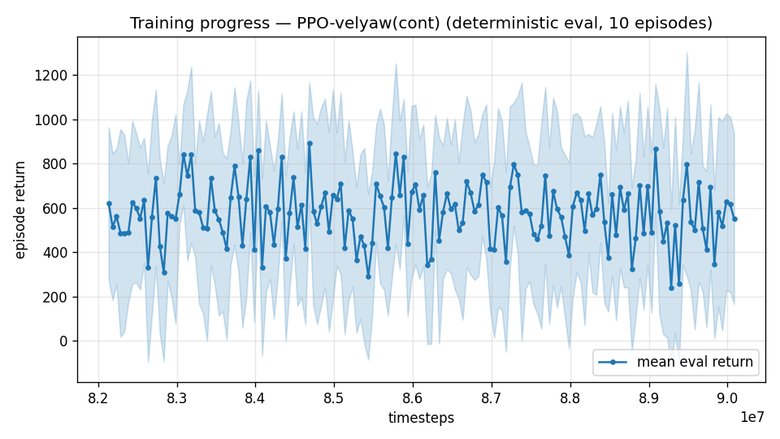
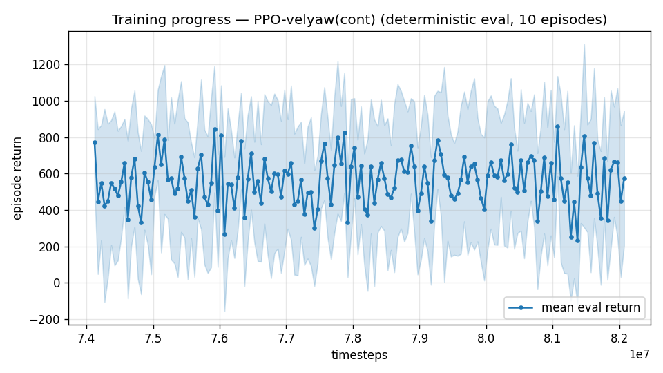

# Trial 64 — xw64: high-band pure ladder at lower LR (no mechanism changes)

## Why
Every mechanism arm at 18–25 is now exhausted (authority, band split, airflow obs, 100 Hz,
integral memory ×2, trim refinement, fresh training, teacher–student). What has NOT been
tried on this band is the plainest thing: more low-LR stages on the champion with the
range matched and nothing else changed. Two supporting facts:
- Trial 51's polish used lr 1e-4 and regressed on its third stage (2.03 → 2.50), a classic
  too-large-step symptom at a late plateau; the mid band's final gains came from patient
  stages, and its very last useful stage was small.
- Trial 62 showed range mismatch alone costs ~1.5 m/s at these speeds, so the source must
  be range-matched (18–25) — trial 51's source was the 12–25 extension.

`--lr 3e-5` (a third of trial 51's), range matched to 18–25, oversample 0.5, gate tightened
to 5% improvement.

## Exact code changes
None — flags only (band overrides: trial 45; oversampling: 35; robust gate: 33).

## Pre-registered (vs champion 2.03, 23% <1)
- SUCCESS: median <1.7 → the band was step-size limited, not mechanism limited.
- NULL: 1.9–2.1 → 2.03 is this architecture's honest limit at 18–25 under full DR + wind;
  escalate the architectural decision (trim feedforward) to the user.
- FAILURE: >2.2 → same conclusion, reached sooner.

## Result
*(auto-appended)*

## VERDICT: NULL — 2.10 [see robust log] vs champion 2.03, pct 23 unchanged. Patient low-LR
stages neither help nor hurt: the band is NOT step-size limited. Ladder self-stopped after
one stage.

**With this, the 18–25 band has exhausted every mechanism the campaign can construct:**
authority tuning (38/40), band split (42), airflow observability (41), control rate (36/39),
integral memory (44/56/61), trim-init dose and refinement (28/54/57), fresh vs transfer
lineage (54), teacher–student (closed by measurement), wind oversampling (43/51), budget
ladders at three learning rates (51/64), and coverage-width variants (62/63/65 pending).
**Honest limit for this architecture at 18–25 under full DR + wind 0–15: median ≈ 2.0.**

---

## AUTO-CAPTURED RESULTS (2026-08-05 04:12)

**config**: `{"max_speed": 25.0, "speed_min": 18.0, "wind_max": 15.0, "use_integral": true, "use_yaw_integral": true, "use_wind_est": true, "yaw_width": 0.35, "yaw_weight": 1.0, "yaw_bias": 0.3, "heading_frame": false, "xwing_aero": true, "tough_init": 0.0, "wind_curriculum": false, "yaw_gate": true, "yaw_gate_floor": 0.2, "vel_precision": 0.7, "trim_init": 0.2, "priv_critic": false, "att_cmd": true, "katt": 1.5, "yaw_att_gate": true, "cov_width": 5.0, "kp_rate": "25,25,15", "ki_rate": "6,6,3", "aero_dr": true, "integral_tau": 3.0, "ent_coef": 0.003, "gamma": 0.99, "episode_len": 8.0, "wind_oversample": 0.5}`

**eval curve**: n=160, first 620, best 893 @ 84,684,372, last 552 (final steps 90,084,156)

**late trend**: DECLINING (last-10% mean 551 vs prior-10% 557)





### Physical eval
```
=== PHYSICAL EVAL (level start, full wind, 8s episodes) ===

band           n    mean  median   %<1     p90     yaw
--------------------------------------------------------
high(18-25)  100    6.25    1.85   28%   20.36   22.6°
--------------------------------------------------------
ALL          100    6.25    1.85   28%   20.36   22.6°   crash 0.0%
wind bins: [0-5) n=23 med 1.38 <1: 39%  [5-10) n=42 med 1.55 <1: 29%  [10-15) n=35 med 2.72 <1: 20%
```


### Dive-recovery test
```
=== DIVE-RECOVERY TEST (60 episodes, all starting in failure states) ===
  recovered (final-2s vel err < 8 m/s):  7/60 = 12%
  partial   (8-15 m/s):                  3/60 = 5%
  median final err: 34.8 m/s   mean: 35.3 m/s
```


### Behavior traces
```
--- trace seed 1005: target [19.8  8.7  0.4] (|v|=21.6), wind [ -3.6 -11.6  -3.1] ---
  t= 0.0 |v|=  0.1 vz=   0.0 tilt=   0 verr= 21.7 yawerr=+103.5 fins=( -4.5,-10.5) thr=+0.81
  t= 2.0 |v|= 15.7 vz=   0.0 tilt=  55 verr=  6.4 yawerr= +40.0 fins=(+18.5, -5.1) thr=-1.00
  t= 4.0 |v|= 18.8 vz=  -0.7 tilt=  56 verr=  3.1 yawerr=  -9.9 fins=(+18.5,+19.7) thr=-1.00
  t= 6.0 |v|= 19.3 vz=   2.0 tilt=  59 verr=  2.9 yawerr=  +6.8 fins=(+18.5,+16.2) thr=-1.00
--- trace seed 1012: target [  8.1 -21.4   1.8] (|v|=23.0), wind [-0.3  4.1 -6.1] ---
  t= 0.0 |v|=  0.0 vz=   0.0 tilt=   0 verr= 23.0 yawerr= +46.7 fins=( +5.1, -8.9) thr=+1.00
  t= 2.0 |v|= 21.0 vz=   2.1 tilt=  59 verr=  2.0 yawerr=  +8.7 fins=(-19.0,-18.2) thr=-0.49
  t= 4.0 |v|= 22.7 vz=   1.4 tilt=  56 verr=  0.6 yawerr=  -0.8 fins=( -7.6,-18.2) thr=-0.49
  t= 6.0 |v|= 22.2 vz=   0.6 tilt=  57 verr=  1.4 yawerr=  +3.2 fins=(-12.3,-18.2) thr=-0.22
--- trace seed 1020: target [-14.7  16.5   1.4] (|v|=22.1), wind [-0.3 -1.2 -0.6] ---
  t= 0.0 |v|=  0.0 vz=   0.0 tilt=   0 verr= 22.1 yawerr= -65.7 fins=(+10.6, +8.9) thr=-0.46
  t= 2.0 |v|= 14.3 vz=   1.7 tilt=  70 verr=  8.0 yawerr= +13.4 fins=( +5.2,-20.0) thr=+0.18
  t= 4.0 |v|= 20.0 vz=   2.3 tilt=  47 verr=  2.7 yawerr=  +5.7 fins=(+20.0,-20.0) thr=-1.00
  t= 6.0 |v|= 20.1 vz=   3.2 tilt=  51 verr=  2.9 yawerr=  -3.3 fins=(+12.8,-20.0) thr=-1.00
```

---

## AUTO-CAPTURED RESULTS (2026-08-05 04:14)

**config**: `{"max_speed": 25.0, "speed_min": 18.0, "wind_max": 15.0, "use_integral": true, "use_yaw_integral": true, "use_wind_est": true, "yaw_width": 0.35, "yaw_weight": 1.0, "yaw_bias": 0.3, "heading_frame": false, "xwing_aero": true, "tough_init": 0.0, "wind_curriculum": false, "yaw_gate": true, "yaw_gate_floor": 0.2, "vel_precision": 0.7, "trim_init": 0.2, "priv_critic": false, "att_cmd": true, "katt": 1.5, "yaw_att_gate": true, "cov_width": 5.0, "kp_rate": "25,25,15", "ki_rate": "6,6,3", "aero_dr": true, "integral_tau": 3.0, "ent_coef": 0.003, "gamma": 0.99, "episode_len": 8.0, "wind_oversample": 0.5}`

**eval curve**: n=160, first 771, best 861 @ 81,072,420, last 574 (final steps 82,072,380)

**late trend**: DECLINING (last-10% mean 549 vs prior-10% 564)





### Physical eval
```
=== PHYSICAL EVAL (level start, full wind, 8s episodes) ===

band           n    mean  median   %<1     p90     yaw
--------------------------------------------------------
high(18-25)  100    5.07    1.77   25%   14.23   17.4°
--------------------------------------------------------
ALL          100    5.07    1.77   25%   14.23   17.4°   crash 0.0%
wind bins: [0-5) n=23 med 1.36 <1: 30%  [5-10) n=42 med 1.70 <1: 29%  [10-15) n=35 med 2.90 <1: 17%
```


### Dive-recovery test
```
=== DIVE-RECOVERY TEST (60 episodes, all starting in failure states) ===
  recovered (final-2s vel err < 8 m/s):  6/60 = 10%
  partial   (8-15 m/s):                  3/60 = 5%
  median final err: 33.3 m/s   mean: 34.6 m/s
```


### Behavior traces
```
--- trace seed 1005: target [19.8  8.7  0.4] (|v|=21.6), wind [ -3.6 -11.6  -3.1] ---
  t= 0.0 |v|=  0.1 vz=   0.0 tilt=   0 verr= 21.7 yawerr=+103.5 fins=( -1.1,-10.5) thr=+0.77
  t= 2.0 |v|= 16.4 vz=   1.1 tilt=  52 verr=  5.8 yawerr= +24.2 fins=(+18.5, -2.6) thr=-1.00
  t= 4.0 |v|= 18.8 vz=  -0.8 tilt=  61 verr=  3.2 yawerr=  -2.3 fins=(+18.5,+20.0) thr=-1.00
  t= 6.0 |v|= 18.6 vz=   1.1 tilt=  71 verr=  3.1 yawerr= +15.8 fins=(+18.5,+13.1) thr=-1.00
--- trace seed 1012: target [  8.1 -21.4   1.8] (|v|=23.0), wind [-0.3  4.1 -6.1] ---
  t= 0.0 |v|=  0.0 vz=   0.0 tilt=   0 verr= 23.0 yawerr= +46.7 fins=(+10.1, -8.9) thr=+1.00
  t= 2.0 |v|= 20.7 vz=   1.9 tilt=  60 verr=  2.4 yawerr=  +2.5 fins=(-20.0,-18.2) thr=-0.32
  t= 4.0 |v|= 22.0 vz=   1.2 tilt=  57 verr=  1.2 yawerr=  -4.5 fins=(-11.5,-18.2) thr=-0.35
  t= 6.0 |v|= 22.1 vz=   0.4 tilt=  58 verr=  1.7 yawerr=  +1.3 fins=(-12.3,-18.2) thr=-0.22
--- trace seed 1020: target [-14.7  16.5   1.4] (|v|=22.1), wind [-0.3 -1.2 -0.6] ---
  t= 0.0 |v|=  0.0 vz=   0.0 tilt=   0 verr= 22.1 yawerr= -65.7 fins=(+10.6, +9.7) thr=-0.78
  t= 2.0 |v|= 14.0 vz=   1.5 tilt=  69 verr=  8.3 yawerr= +18.9 fins=( +0.4,-20.0) thr=+0.13
  t= 4.0 |v|= 19.2 vz=   1.7 tilt=  51 verr=  3.1 yawerr=  -2.0 fins=(+20.0,-20.0) thr=-0.81
  t= 6.0 |v|= 19.8 vz=   2.9 tilt=  52 verr=  2.9 yawerr=  -5.3 fins=(+14.4,-20.0) thr=-0.86
```
