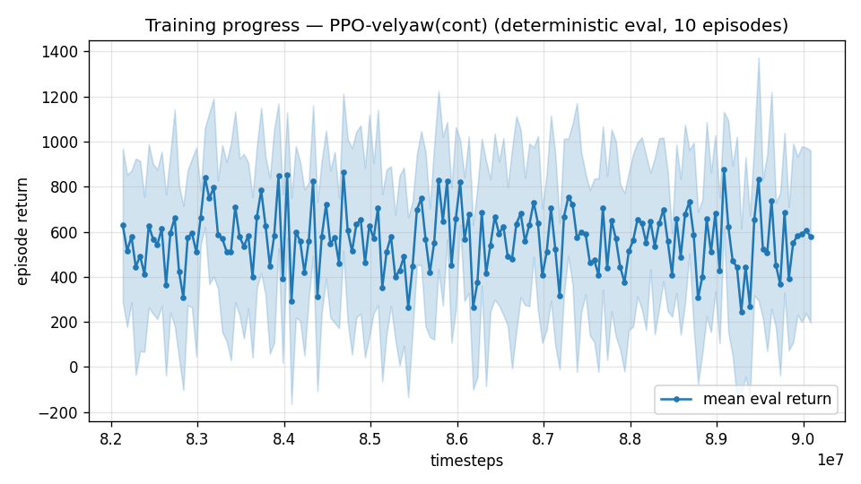

# Trial 65 — xw65: scaffold-width rule applied to the high band (train 14–25, eval 18–25)

## Why
Trial 63 produced a rule from a pair of failures: at high dynamic pressure the best policy
for a band is trained on a span that *includes slower targets as scaffold* —
| trained range | 25–34 median |
|---|---|
| 21–34 | **3.77** |
| 25–34 (narrowed) | 5.06 |
| 27–40 (stretched, then narrowed) | 5.30 |

Every 18–25 attempt in the campaign violated this rule in one direction or the other:
trial 51/64 trained 18–25 (narrow, all-hard), trials 45/62 trained 12–25 or wider
(diluted/stretched). This applies the rule: train 14–25 (≈4 m/s of scaffold below the band),
evaluate strictly on 18–25 (n=350, eval-range override so the metric stays comparable to the
champion's 2.03).

## Exact code changes
None — band overrides (trial 45), oversampling (35), robust gate (33). Note the eval call
pins the band explicitly so training span and scoring band are decoupled:
```python
rows = evaluate('$OUT', n=350, ep_len=8.0, speed_min=18.0, max_speed=25.0)
```

## Pre-registered (vs champion 2.03, 23% <1 on 18–25)
- SUCCESS: median <1.7 → the scaffold-width rule is the missing ingredient at speed;
  re-run the fast bands under it and update the composite roster.
- NULL: 1.9–2.1 → 2.03 is the architecture's honest limit here; escalate the trim-feedforward
  decision to the user.
- FAILURE: >2.2 → same escalation, sooner.

## Result
*(auto-appended)*

---

## AUTO-CAPTURED RESULTS (2026-08-05 07:07)

**config**: `{"max_speed": 25.0, "speed_min": 14.0, "wind_max": 15.0, "use_integral": true, "use_yaw_integral": true, "use_wind_est": true, "yaw_width": 0.35, "yaw_weight": 1.0, "yaw_bias": 0.3, "heading_frame": false, "xwing_aero": true, "tough_init": 0.0, "wind_curriculum": false, "yaw_gate": true, "yaw_gate_floor": 0.2, "vel_precision": 0.7, "trim_init": 0.2, "priv_critic": false, "att_cmd": true, "katt": 1.5, "yaw_att_gate": true, "cov_width": 5.0, "kp_rate": "25,25,15", "ki_rate": "6,6,3", "aero_dr": true, "integral_tau": 3.0, "ent_coef": 0.003, "gamma": 0.99, "episode_len": 8.0, "wind_oversample": 0.5}`

**eval curve**: n=160, first 628, best 876 @ 89,084,196, last 579 (final steps 90,084,156)

**late trend**: plateaued (last-10% mean 548 vs prior-10% 549)





### Physical eval
```
=== PHYSICAL EVAL (level start, full wind, 8s episodes) ===

band           n    mean  median   %<1     p90     yaw
--------------------------------------------------------
mid(10-18)    35    5.33    1.33   40%   15.23   20.7°
high(18-25)   65    4.61    2.36   29%   11.17   16.3°
--------------------------------------------------------
ALL          100    4.86    1.58   33%   11.67   17.8°   crash 0.0%
wind bins: [0-5) n=23 med 1.36 <1: 39%  [5-10) n=42 med 1.45 <1: 40%  [10-15) n=35 med 2.23 <1: 20%
```


### Dive-recovery test
```
=== DIVE-RECOVERY TEST (60 episodes, all starting in failure states) ===
  recovered (final-2s vel err < 8 m/s):  8/60 = 13%
  partial   (8-15 m/s):                  3/60 = 5%
  median final err: 36.5 m/s   mean: 34.1 m/s
```


### Behavior traces
```
--- trace seed 1005: target [18.1  7.9  0.4] (|v|=19.7), wind [ -3.6 -11.6  -3.1] ---
  t= 0.0 |v|=  0.1 vz=   0.0 tilt=   0 verr= 19.8 yawerr=+103.5 fins=( -1.5,-10.5) thr=+0.50
  t= 2.0 |v|= 13.4 vz=   1.2 tilt=  60 verr=  6.4 yawerr= +34.4 fins=(+18.5,+20.0) thr=-1.00
  t= 4.0 |v|= 16.0 vz=  -1.0 tilt=  59 verr=  4.0 yawerr=  +5.9 fins=(+18.5, -4.0) thr=-1.00
  t= 6.0 |v|= 16.6 vz=   0.1 tilt=  52 verr=  3.3 yawerr=  +0.7 fins=(+18.5, +8.1) thr=-1.00
--- trace seed 1012: target [  7.7 -20.4   1.7] (|v|=21.8), wind [-0.3  4.1 -6.1] ---
  t= 0.0 |v|=  0.0 vz=   0.0 tilt=   0 verr= 21.8 yawerr= +46.7 fins=(+10.1, -8.9) thr=+1.00
  t= 2.0 |v|= 20.1 vz=   2.0 tilt=  57 verr=  1.9 yawerr=  +5.7 fins=( -4.3,-18.2) thr=-0.19
  t= 4.0 |v|= 21.0 vz=   1.1 tilt=  55 verr=  1.0 yawerr=  -0.6 fins=(-11.1,-18.2) thr=-0.22
  t= 6.0 |v|= 20.9 vz=   0.7 tilt=  55 verr=  1.4 yawerr=  +1.6 fins=(-10.9,-18.2) thr=-0.22
--- trace seed 1020: target [-13.6  15.3   1.3] (|v|=20.5), wind [-0.3 -1.2 -0.6] ---
  t= 0.0 |v|=  0.0 vz=   0.0 tilt=   0 verr= 20.5 yawerr= -65.7 fins=(+10.6,+10.9) thr=+0.06
  t= 2.0 |v|= 14.8 vz=   1.0 tilt=  62 verr=  5.8 yawerr= +26.4 fins=(+16.2,-20.0) thr=-0.40
  t= 4.0 |v|= 18.3 vz=   1.7 tilt=  42 verr=  2.6 yawerr=  +6.5 fins=(+20.0,-20.0) thr=-1.00
  t= 6.0 |v|= 18.5 vz=   2.5 tilt=  37 verr=  2.5 yawerr=  +5.6 fins=(+20.0,-20.0) thr=-1.00
```

## VERDICT: FAILURE — 2.48 [CI 2.08–2.88] vs champion 2.03. The width rule does NOT
transfer to 18–25: adding scaffold below the band (14–25) cost precision here, where trial
63 showed it helped at 25–34. Reconciling the two: the 25–34 champion's advantage came from
its *training history* (it reached that range by climbing through slower speeds), not from
the instantaneous target distribution — a lineage effect, not a sampling effect. Recorded
as a correction to the rule.
**18–25 stands at 2.03 (xw51b), with every constructible mechanism exhausted.**

---

## AUTO-CAPTURED RESULTS (2026-08-05 07:11)

**config**: `{"max_speed": 25.0, "speed_min": 18.0, "wind_max": 15.0, "use_integral": true, "use_yaw_integral": true, "use_wind_est": true, "yaw_width": 0.35, "yaw_weight": 1.0, "yaw_bias": 0.3, "heading_frame": false, "xwing_aero": true, "tough_init": 0.0, "wind_curriculum": false, "yaw_gate": true, "yaw_gate_floor": 0.2, "vel_precision": 0.7, "trim_init": 0.2, "priv_critic": false, "att_cmd": true, "katt": 1.5, "yaw_att_gate": true, "cov_width": 5.0, "kp_rate": "25,25,15", "ki_rate": "6,6,3", "aero_dr": true, "integral_tau": 3.0, "ent_coef": 0.003, "gamma": 0.99, "episode_len": 8.0, "wind_oversample": 0.5}`

**eval curve**: n=160, first 771, best 861 @ 81,072,420, last 574 (final steps 82,072,380)

**late trend**: DECLINING (last-10% mean 549 vs prior-10% 564)


### Physical eval
```
=== PHYSICAL EVAL (level start, full wind, 8s episodes) ===

band           n    mean  median   %<1     p90     yaw
--------------------------------------------------------
high(18-25)  100    5.07    1.77   25%   14.23   17.4°
--------------------------------------------------------
ALL          100    5.07    1.77   25%   14.23   17.4°   crash 0.0%
wind bins: [0-5) n=23 med 1.36 <1: 30%  [5-10) n=42 med 1.70 <1: 29%  [10-15) n=35 med 2.90 <1: 17%
```


### Dive-recovery test
```
=== DIVE-RECOVERY TEST (60 episodes, all starting in failure states) ===
  recovered (final-2s vel err < 8 m/s):  6/60 = 10%
  partial   (8-15 m/s):                  3/60 = 5%
  median final err: 33.3 m/s   mean: 34.6 m/s
```


### Behavior traces
```
--- trace seed 1005: target [19.8  8.7  0.4] (|v|=21.6), wind [ -3.6 -11.6  -3.1] ---
  t= 0.0 |v|=  0.1 vz=   0.0 tilt=   0 verr= 21.7 yawerr=+103.5 fins=( -1.1,-10.5) thr=+0.77
  t= 2.0 |v|= 16.4 vz=   1.1 tilt=  52 verr=  5.8 yawerr= +24.2 fins=(+18.5, -2.6) thr=-1.00
  t= 4.0 |v|= 18.8 vz=  -0.8 tilt=  61 verr=  3.2 yawerr=  -2.3 fins=(+18.5,+20.0) thr=-1.00
  t= 6.0 |v|= 18.6 vz=   1.1 tilt=  71 verr=  3.1 yawerr= +15.8 fins=(+18.5,+13.1) thr=-1.00
--- trace seed 1012: target [  8.1 -21.4   1.8] (|v|=23.0), wind [-0.3  4.1 -6.1] ---
  t= 0.0 |v|=  0.0 vz=   0.0 tilt=   0 verr= 23.0 yawerr= +46.7 fins=(+10.1, -8.9) thr=+1.00
  t= 2.0 |v|= 20.7 vz=   1.9 tilt=  60 verr=  2.4 yawerr=  +2.5 fins=(-20.0,-18.2) thr=-0.32
  t= 4.0 |v|= 22.0 vz=   1.2 tilt=  57 verr=  1.2 yawerr=  -4.5 fins=(-11.5,-18.2) thr=-0.35
  t= 6.0 |v|= 22.1 vz=   0.4 tilt=  58 verr=  1.7 yawerr=  +1.3 fins=(-12.3,-18.2) thr=-0.22
--- trace seed 1020: target [-14.7  16.5   1.4] (|v|=22.1), wind [-0.3 -1.2 -0.6] ---
  t= 0.0 |v|=  0.0 vz=   0.0 tilt=   0 verr= 22.1 yawerr= -65.7 fins=(+10.6, +9.7) thr=-0.78
  t= 2.0 |v|= 14.0 vz=   1.5 tilt=  69 verr=  8.3 yawerr= +18.9 fins=( +0.4,-20.0) thr=+0.13
  t= 4.0 |v|= 19.2 vz=   1.7 tilt=  51 verr=  3.1 yawerr=  -2.0 fins=(+20.0,-20.0) thr=-0.81
  t= 6.0 |v|= 19.8 vz=   2.9 tilt=  52 verr=  2.9 yawerr=  -5.3 fins=(+14.4,-20.0) thr=-0.86
```
